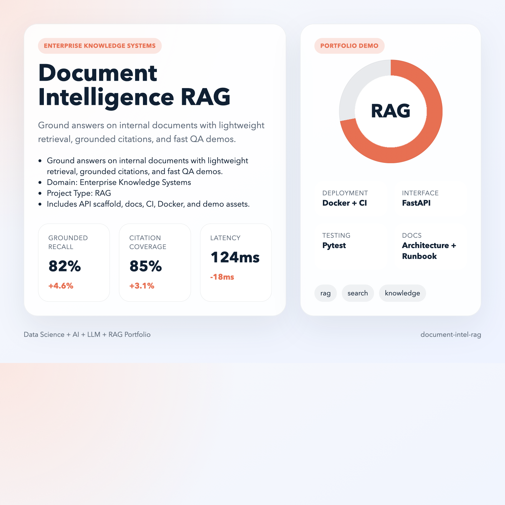

# Document Intelligence RAG



## Overview
Ground answers on internal documents with lightweight retrieval, grounded citations, and fast QA demos.

This project is part of a 50-project portfolio covering data science, AI, LLM, RAG, and product analytics use cases across finance, health, retail, cybersecurity, developer tools, and enterprise workflows.

## Project Profile
- Domain: Enterprise Knowledge Systems
- Project type: `rag`
- Tags: rag, search, knowledge

## Quick Start
```bash
python -m venv .venv
source .venv/bin/activate
pip install -r requirements.txt
python scripts/bootstrap_data.py
uvicorn src.app.main:app --host 0.0.0.0 --port 8000 --reload
```

## Key Endpoints
- `GET /health`
- `GET /project`
- `POST /score`
- `POST /analyze`
- `POST /query`

## Structure
```text
document-intel-rag/
|- configs/
|- data/
|- demo/
|- docs/
|- scripts/
|- src/app/
|- tests/
|- .github/workflows/
|- Dockerfile
|- docker-compose.yml
|- Makefile
```
